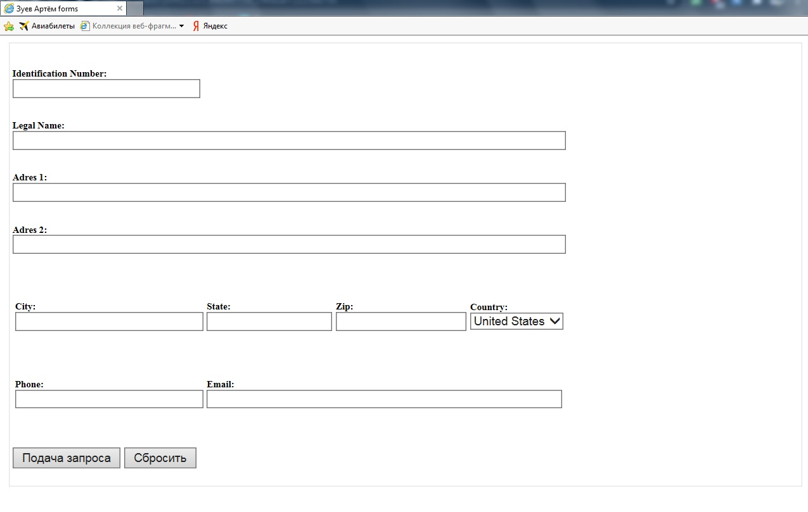
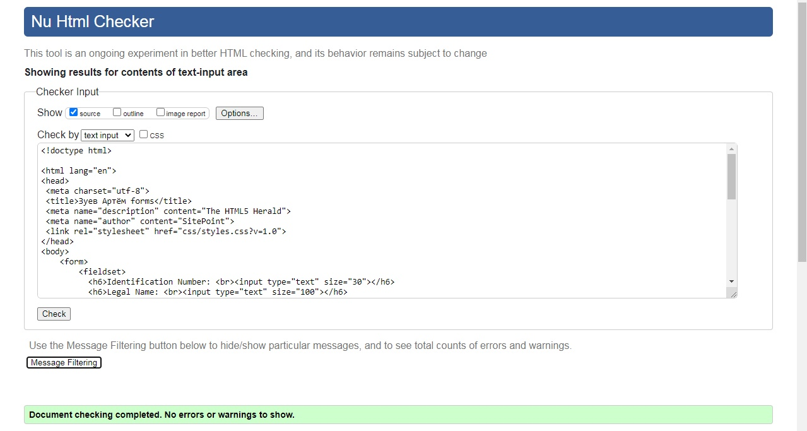
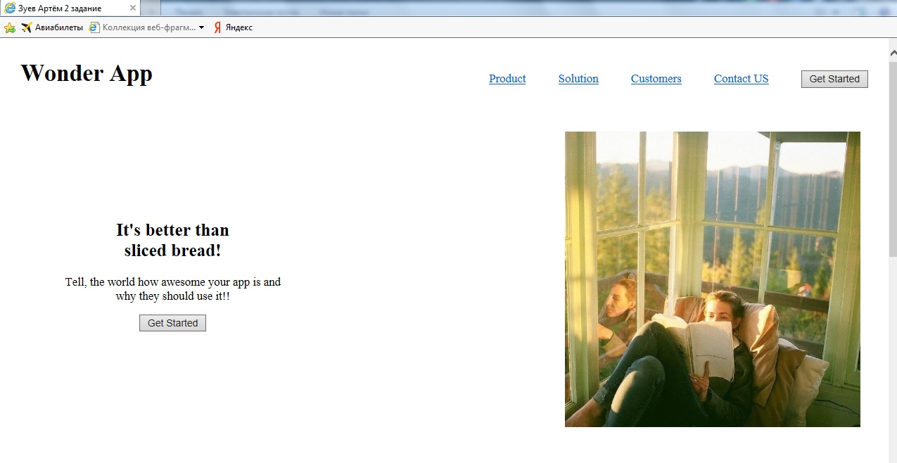
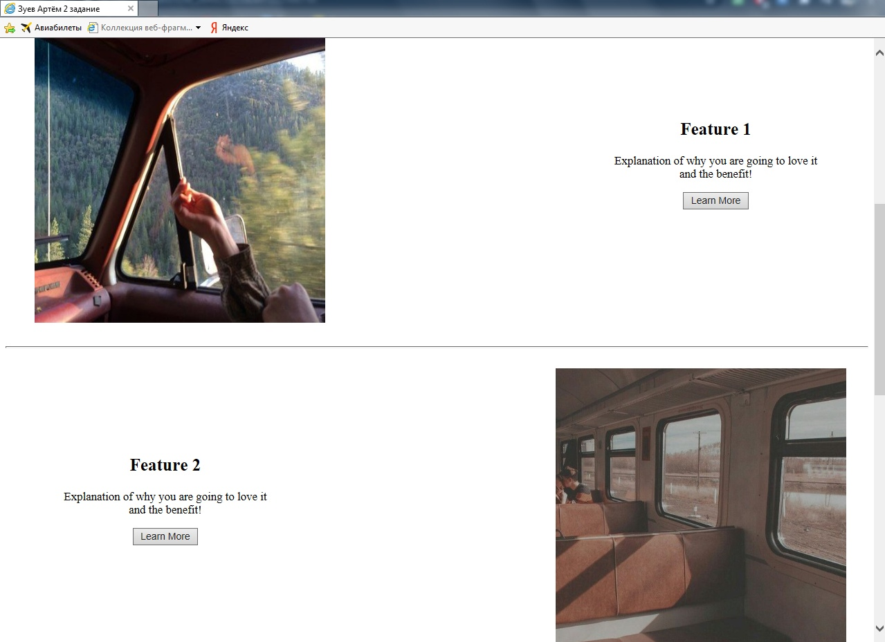
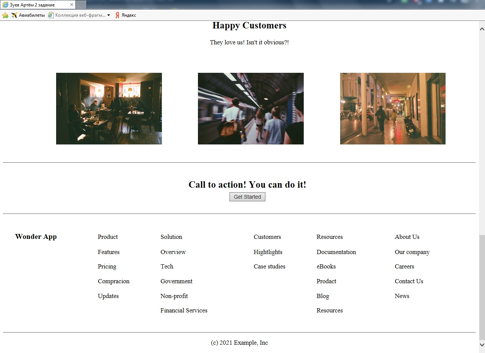
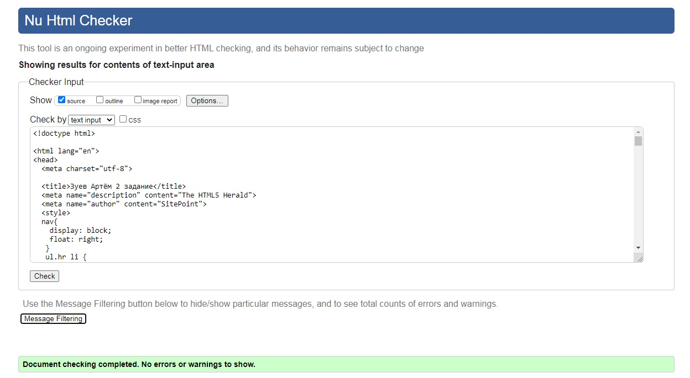

МИНИСТЕРСТВО НАУКИ И ВЫСШЕГО ОБРАЗОВАНИЯ РОССИЙСКОЙ ФЕДЕРАЦИИ 
ФЕДЕРАЛЬНОЕ ГОСУДАРСТВЕННОЕ БЮДЖЕТНОЕ ОБРАЗОВАТЕЛЬНОЕ  
УЧРЕЖДЕНИЕ ВЫСШЕГО ОБРАЗОВАНИЯ 
«ВЯТСКИЙ ГОСУДАРСТВЕННЫЙ УНИВЕРСИТЕТ» 
Институт математики и информационных систем 
Факультет автоматики и вычислительной техники 
Кафедра систем автоматизации управления 

 
 
 
 
 
 
 
 
 

<b>Изучение блочных элементов и компонентов разметки форм в HTML5</b> 
Отчет по лабораторной работе № 2 
по дисциплине 
Основы frontend-разработки и организации человеко-машинного интерфейса 

 
 
 
 
 
 

Выполнил студент гр. ИТб-1301-01-00	        _________________ /Зуев А.И./ 
Руководитель ст. преподаватель		        _________________ /Земцов М.А./ 

 
 

Киров 2021

 
 
 

<h1>Задание 1</h1>

Разработайте макет формы регистрации пользователя. Код должен быть валидирован под HTML5

Разработанная мною форма представлена на рисунке 1. Проверка кода на валидность продемонстрирована на рисунке 2. Листинг файла приведён в приложении А

Рисунок 1 – Вид разработанной мною формы 

 

Рисунок 2 – Успешная проверка кода на валидность первого задания

 

<h1>Задание 2</h1>

Создайте каркас сайта по варианту
 

Разработанный мною сайт представлен на рисунках 3-5. Проверка кода на валидность продемонстрирована на рисунке 6. Листинг файла приведён в приложении Б

Рисунок 3 – Шапка сайта 

 

Рисунок 4 – Центральная часть сайта 

 

Рисунок 5 – Подвал сайта 

 

Рисунок 6 – Успешная проверка кода на валидность второго задания

 

Вывод: блочные элементы, изученные нами в ходе лабораторной работы, выступают в качестве основного строительного материала при верстке веб-страниц.

 

Приложение А

(обязательное)

Листинг файла form.html

 
    
    <!doctype html>
    <html lang="en">
    <head>
    <meta charset="utf-8">
    <title>Зуев Артём forms</title>
    <meta name="description" content="The HTML5 Herald">
    <meta name="author" content="SitePoint">
    <link rel="stylesheet" href="css/styles.css?v=1.0">
    </head>
    <body>
        <form>
            <fieldset>
            <h6>Identification Number:  <input type="text" size="30"></h6>   
            <h6>Legal Name:  <input type="text" size="100"></h6>  
            <h6>Adres 1:  <input type="text" size="100" ></h6>
            <h6>Adres 2:  <input type="text" size="100"></h6>
                
<table>
                        <tr>
                        <td><h6>City:  <input type="text" size="30"></h6></td> 
                        <td><h6>State:  <input type="text" size="18"></h6></td> 
                        <td><h6>Zip:  <input type="text" size="19"></h6></td>
                        <td><h6>Country:  <select >
                                <option>United States</option>
                                <option>California</option>
                                <option>Colorado</option>
                                <option>Alaska</option>
                                <option>Georgia</option>
                                <option>Iowa</option>
                                </select></h6></td>
                        </tr>                              
                        <tr>
                        <td><h6>Phone:  <input type="text" size="30"></h6></td>
                        <td colspan="3"><h6>Email:  <input type="text" size="62"></h6></td>
                        </tr>
                    </table>
                
<input type="submit" > <input type="reset" >

            </fieldset>
        </form>
    </body>
    </html> 

 

Приложение Б

(обязательное)

Листинг файла index.html

 

    <!DOCTYPE html>
    <html lang="en">
    <head>
    <meta charset="UTF-8">
    <meta http-equiv="X-UA-Compatible" content="IE=edge">
    <meta name="viewport" content="width=device-width, initial-scale=1.0">
    <title>Зуев Артём 2 задание</title>
    
    </head>
    <body>
    <header style="height: 150px" class="main">
        <article class="heddder">
        <h1 style="margin-left:50px">Wonder App</h1>
        </article>
        
 
        <nav>
        <ul class="hr">
            <li><a href="#p1">Product</a></li>
            <li><a href="#p2">Solution</a></li>
            <li><a href="#p3">Customers</a></li>
            <li><a href="#p4">Contact US</a></li>
            <li><input type="submit" value="Get Started"></li>
            </ul>
        </nav>
        

    </header>
    
    <main>
        <section id="p1" class="main">
        <article class="main__item">
            
 
            <h2><b>It's better than sliced bread!</b></h2>
            
 Tell, the world how awesome your app is and why they should use it!!

            
<input type="submit" value="Get Started">

            

        </article>
        <article class="main__item">
            

            
            

        </article>
    </section>
    

    <section id="p2" class="main" style="margin-left: 0px;">
        <article class="main__item">
        

            
        

        </article>
        <article class="main__item">
        
 
            <h2><b>Feature 1</b></h2>
        
Explanation of why you are going to love it and the benefit!

        
<input type="submit" value="Learn More">

        

        </article>
    </section>
    

    <section id="p3" class="main">
    <article class="main__item">
        
 
        <h2><b>Feature 2</b></h2>
        
Explanation of why you are going to love it and the benefit!

        
<input type="submit" value="Learn More">

        

    </article>
    <article class="main__item">
        

        
        

    </article>
    </section>
    

    <section>
    <article style="padding: 0px 20px">
        

        <h2 style="text-align:center"><b>Happy Customers</b></h2>
        
They love us! Isn't it obvious?!

        

    

        

        
        
        
        

    

    </article>
    

    <article>
        

        <h2 style="text-align:center">Call to action! You can do it! 
            <input type="submit" value="Get Started">
        </h2>
        

    </article>
    </section>
    

    </main> 
    <footer style="display: table; margin: 0px 30px; width: 95%" >
    

        
<h3>Wonder App</h3>

        
Product

        
Solution

        
Customers

        
Resources

        
About Us

    

    

        

        
Features

        
Overview

        
Hightlights

        
Documentation

        
Our company

    

     
    

        

        
Pricing

        
Tech

        
Case studies

        
eBooks

        
Careers

    

     
    

        

        
Compracion

        
Government

        

        
Prodact

        
Contact Us

    

     
    

        

        
Updates

        
Non-profit

        

        
Blog

        
News

    

     
    

        

        

        
Financial Services

        

        
Resources

        

    

     
     
    </footer>
    

    
(c) 2021 Example, Inc

    </body>
    </html>
 
