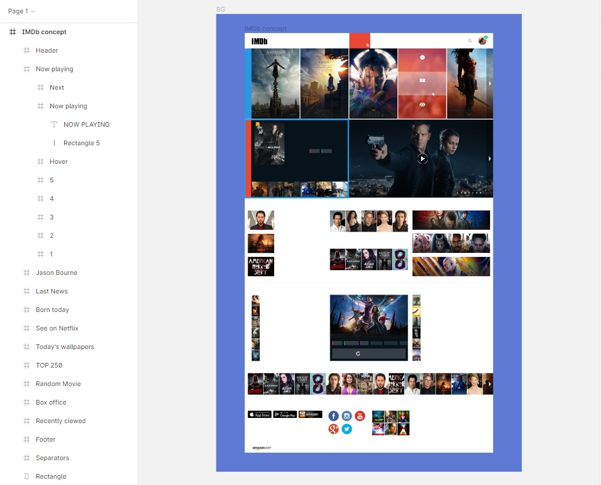

МИНИСТЕРСТВО НАУКИ И ВЫСШЕГО ОБРАЗОВАНИЯ РОССИЙСКОЙ ФЕДЕРАЦИИ 
ФЕДЕРАЛЬНОЕ ГОСУДАРСТВЕННОЕ БЮДЖЕТНОЕ ОБРАЗОВАТЕЛЬНОЕ  
УЧРЕЖДЕНИЕ ВЫСШЕГО ОБРАЗОВАНИЯ 
«ВЯТСКИЙ ГОСУДАРСТВЕННЫЙ УНИВЕРСИТЕТ» 
Институт математики и информационных систем 
Факультет автоматики и вычислительной техники 
Кафедра систем автоматизации управления 

 
 
 
 
 
 
 
 
 

<b>Изучение методов формирования html</b> 
Отчет по лабораторной работе № 2 
по дисциплине 
Основы frontend-разработки и организации человеко-машинного интерфейса 

 
 
 
 
 
 

Выполнил студент гр. ИТб-1301-01-00	        _________________ /Зуев А.И./ 
Руководитель ст. преподаватель		        _________________ /Земцов М.А./ 

 
 

Киров 2021

 
 
 

Цель лабораторной работы: стилизация и трансформация элементов через CSS и CSS процессоры.
 

Задачи лабораторной работы:
 
<ol><li>Организовать процесс работы над лабораторной работой</li>
<li>Изучить материал по основам стилизации элементов</li>
<li>Выполнить верстку макета по заданию преподавателя</li>
<li>Составить отчет по выполненным задачам</li>
<li>Защитить лабораторную работу</li></ol>

 
 
<h2>Задание</h2>

Выполнить верстку макета по заданию преподавателя. Макет представлен на рисунке 1.  

