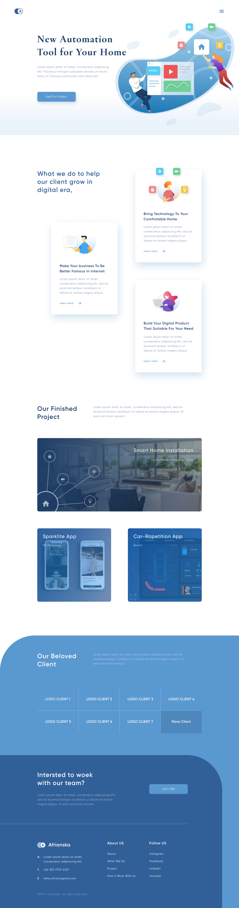
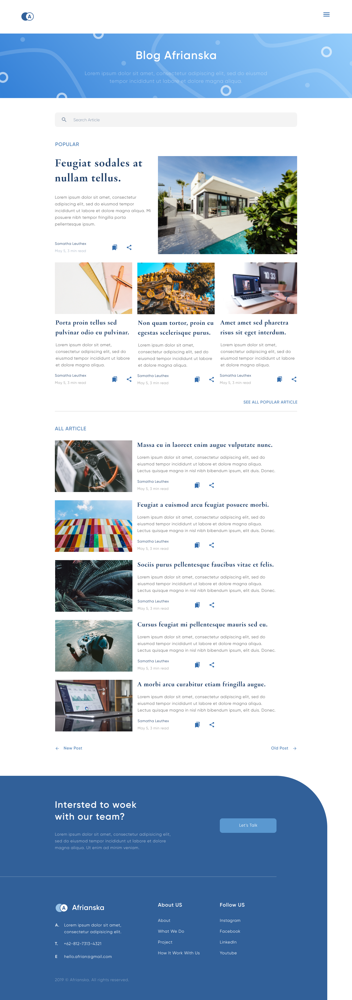
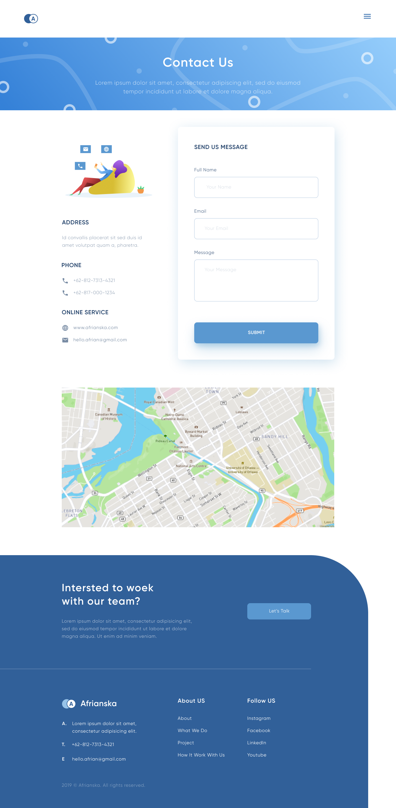
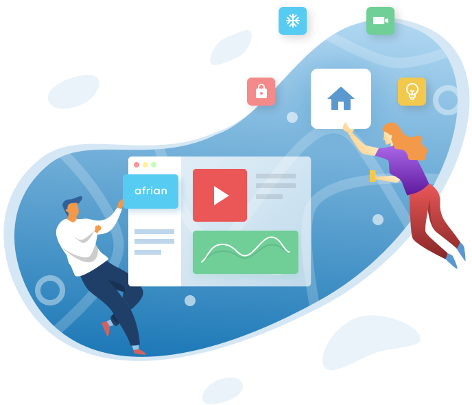
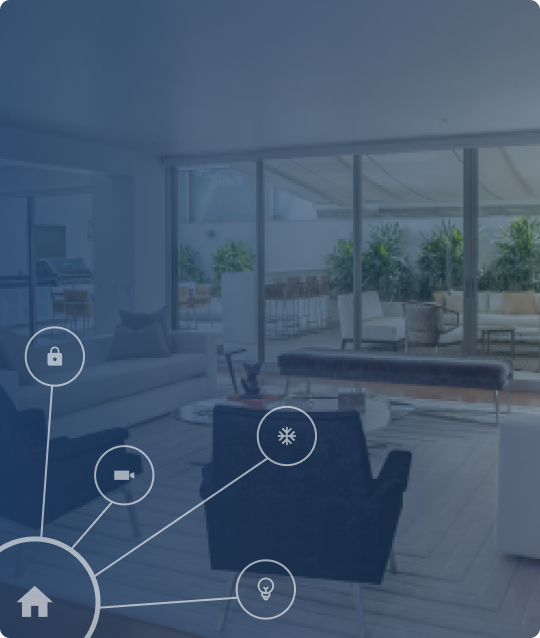
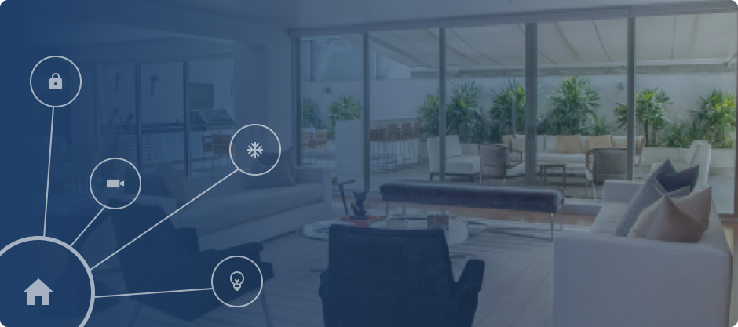

МИНИСТЕРСТВО НАУКИ И ВЫСШЕГО ОБРАЗОВАНИЯ РОССИЙСКОЙ ФЕДЕРАЦИИ 
ФЕДЕРАЛЬНОЕ ГОСУДАРСТВЕННОЕ БЮДЖЕТНОЕ ОБРАЗОВАТЕЛЬНОЕ  
УЧРЕЖДЕНИЕ ВЫСШЕГО ОБРАЗОВАНИЯ 
«ВЯТСКИЙ ГОСУДАРСТВЕННЫЙ УНИВЕРСИТЕТ» 
Институт математики и информационных систем 
Факультет автоматики и вычислительной техники 
Кафедра систем автоматизации управления 

 
 
 
 
 
 
 
 
 

<b>Изучение методов формирования html</b> 
Отчет по лабораторной работе № 4 
по дисциплине 
Основы frontend-разработки и организации человеко-машинного интерфейса 
Вариант 1

 
 
 
 
 
 

Выполнил студент гр. ИТб-1301-01-00 _________________ /Зуев А.И./ 
Руководитель ст. преподаватель _________________ /Земцов М.А./ 

 
 

Киров 2021

 
 
 

Цель лабораторной работы: Изучение основ языка JavaScript.

 

Задачи лабораторной работы:
 
<ol><li>Изучить основные элементы и подходы к программированию в JavaScript</li>
<li>Изучить подходы к работе JavaScript в браузере</li>
<li>Выполнить верстку макета по заданию преподавателя</li>
<li>Составить отчет по выполненным задачам</li>
<li>Защитить лабораторную работу</li></ol>

 
<h2>Задание</h2>

Выполнить верстку макета с применением библиотеки tailwind в соответствии со своим вариантом. Первый макет представлен на рисунке 1.  

Рисунок 1 - Первый макет сайта

 

Второй макет представлен на рисунке 2.  

Рисунок 2 - Второй макет сайта

 

Третий макет представлен на рисунке 3.  

Рисунок 3 - Третий макет сайта

  

Выполненная верстка первого макета по заданию преподавателя продемонстрирована на рисунке 4. Сайт также является адаптивным. Версия для мобильных устройств представлена на рисунке 5. Листинг кода сайта приведён в приложении A.   

Рисунок 4 - Реализованная вёрстка сайта по первому макету для разрешения 1440x1280

 

Рисунок 5 - Реализованная вёрстка сайта по первому макету для мобильных устройств

 

<

Вывод: работа со стиялми в отдельном файле CSS обеспечивает удобное рабочее пространство и облегчает структуру документа, позволяя верстальщику отделять содержание страницы от её визуального оформления.

 

Приложение A

(обязательное)

Листинг первого сайта

 
<code>

    <!DOCTYPE html>
    <html lang="en">
    <head>
    <meta charset="UTF-8">
    <meta name="viewport" content="width=device-width, initial-scale=1.0">
    <meta http-equiv="X-UA-Compatible" content="ie=edge">
    <title>Зуев Артём 1</title>
    <link href="https://unpkg.com/tailwindcss@^1.0/dist/tailwind.min.css" rel="stylesheet">
    </head>

    <body>
    

        <header class="bg-gradient-to-t from-blue-200 to-blue-50">
        <nav class="relative px-6 py-6 lg:px-20 lg:py-10 flex justify-between items-center ">
            
            <button id="btn" class="navbar-burger flex items-center">
            
            </button>
        </nav>

        <!-- блок Hero -->
        

            

            

                

                

                    

                    <h2 class="mb-6 lg:mb-8 text-4xl lg:text-5xl leading-tight font-bold text-blue-900">
                        New Automation Tool for Your Home
                    </h2>
                    

                    

                    
Lorem ipsum
                        dolor sit amet,
                        consectetur adipiscing elit.
                        Faucibus tristique vulputate ultrices ut mauris tellus at.
                        Posuere sollicitudin odio tellus elit.
                    

                    

                    

                    <a class="inline-block text-center font-semibold text-base mb-5 w-full md:w-auto py-3 px-12 leading-loose bg-blue-500 hover:bg-blue-700 text-white font-regular rounded-lg transition duration-400"
                        href="#">See Our Project</a>
                    

                

                

                

                

                    
                

                

            

            

        

        </header>

        <!-- блок what we do -->
        <section>
        

            

            

                <h3
                class="w-full text-center lg:text-left text-3xl lg:text-4xl mb-8 xl:text-5xl mb-8 leading-tight font-semibold text-blue-900">
                What we do to help our client grow in digital era,
                </h3>
            

            

                

                

                    
                    

                    <h3 class="mb-4 text-blue-900 font-semibold text-xl lg:text-2xl">
                        Make Your business To Be Better Famous In Internet
                    </h3>
                    

                        Lorem ipsum dolor sit amet, consectetur
                        adipiscing elit, sed do eiusmod tempor incididunt ut labore et dolore magna aliqua.
                    

                    

                        
                    

                    

                

                

                

                
                

                    <h3 class="mb-4 text-blue-900 font-semibold text-xl lg:text-2xl">
                    Bring Technology To Your Comfrotable Home
                    </h3>
                    

                    Lorem ipsum dolor sit amet, consectetur
                    adipiscing elit, sed do eiusmod tempor incididunt ut labore et dolore magna aliqua.
                    

                    

                    
                    

                

                

                

                
                

                    <h3 class="mb-4 text-blue-900 font-semibold text-xl lg:text-2xl">
                    Build Your Digital Product That Suitable For Your Need
                    </h3>
                    

                    Lorem ipsum dolor sit amet, consectetur
                    adipiscing elit, sed do eiusmod tempor incididunt ut labore et dolore magna aliqua.
                    

                    

                    
                    

                

                

            

            

        

        </section>

        <!-- блок our_project -->
        <section>
        

            

            

                

                <h3
                    class="w-full text-center lg:text-left text-3xl lg:text-4xl xl:text-5xl mb-8 leading-tight font-semibold text-blue-900">
                    Our Finished Project
                </h3>
                

                

                

                

                    Lorem ipsum dolor sit amet, consectetur adipisicing elit,
                    sed do eiusmod tempor incididunt ut
                    labore et dolore magna aliqua. Ut enim ad minim veniam.

                

                

                

                    <h3 class="text-right pb-1 px-10 font-medium text-xl leading-none text-white">Smart Home Installation
                    </h3>
                    
In Muarakana Housing Estate

                

                
                

                

                

                    <h3 class="text-right pr-10 font-medium text-2xl leading-normal text-white xl:text-3xl">Smart Home
                    Installation</h3>
                    
In Muarakana
                    Housing Estate

                

                
                

                

                

                    

                    <h3 class="font-medium pt-5 pb-1 text-xl leading-none text-white lg:pt-10 lg:text-2xl xl:text-3xl">
                        Sparklite App</h3>
                    
Marketplace

                    

                    
                

                

                    

                    <h3 class="font-medium pt-5 pb-1 text-xl leading-none text-white lg:pt-10 lg:text-2xl xl:text-3xl">
                        Car-Rapetition App</h3>
                    
Board

                    

                    
                

                

            

            

        

        </section>
    

    <footer>

        

        <!-- для планшетов и выше -->
        

            

            

                

                <h3
                    class="w-full text-center lg:text-left text-3xl mb-8 xl:text-4xl leading-tight font-semibold text-white">
                    Our Finished Project
                </h3>
                

                

                

                

                    Lorem ipsum dolor sit amet, consectetur adipisicing elit,
                    sed do eiusmod tempor incididunt ut
                    labore et dolore magna aliqua. Ut enim ad minim veniam.

                

            

            

        

        

            

            

                
LOGO CLIENT 1

                
LOGO CLIENT 2

                
LOGO CLIENT 3

                
LOGO CLIENT 4

                
LOGO CLIENT 5

                
LOGO CLIENT
                6

                
LOGO CLIENT 7

                

                More Client

            

            

            

            

                

                

                    

                    <h3
                        class="w-full text-center lg:text-left text-3xl mb-8 xl:text-4xl leading-tight font-semibold text-white">
                        Intersted to woek with our team?
                    </h3>
                    

                        Lorem ipsum dolor sit amet, consectetur adipisicing elit,
                        sed do eiusmod tempor incididunt ut
                        labore et dolore magna aliqua. Ut enim ad minim veniam.
                    

                    

                

                

                

                    

                    <a class="inline-block text-center font-semibold text-base mb-5 w-full md:w-auto py-3 px-12 leading-loose bg-blue-500 hover:bg-blue-700 
                    text-white font-regular rounded-lg transition duration-400">Let’s Talk</a>
                    

                

                

            

            

            

            

            

            

                

                

                    
                    

                    
A.

                    
Lorem ipsum dolor sit amet, consectetur adipisicing
                        elit.

                    
T.

                    
+62-812-7313-4321

                    
E.

                    
hello.afrian@gmail.com

                    

                

                

                    
About US

                    

                    
About

                    
What We Do

                    
Project

                    
How It Work With Us

                    

                

                

                    
Follow US

                    

                    
Instagram

                    
Facebook

                    
LinkedIn

                    
Youtube

                    

                

                

            

            

                
2019 © Afrianska. All rights reserved.

            

            

        

        

    </footer>
    
    </body>

    </html>
    
</code>

Приложение B

(обязательное)

Листинг второго сайта

 
<code>
   
</code>