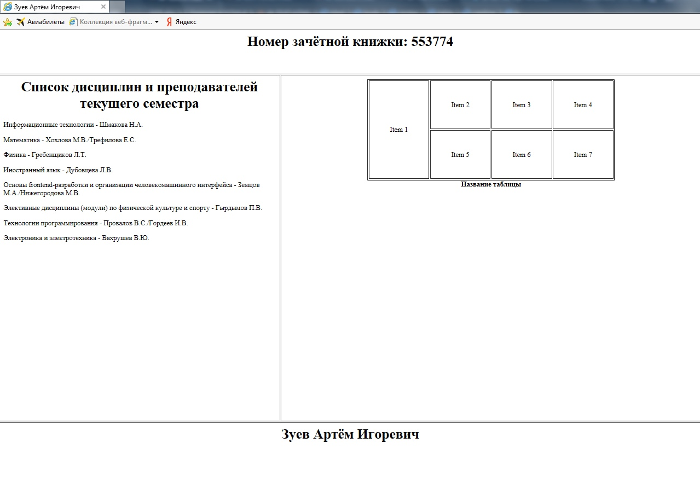
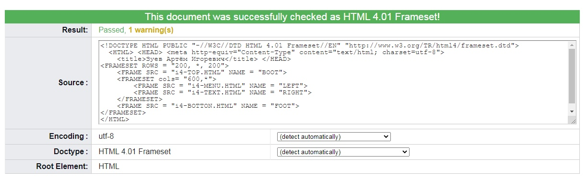
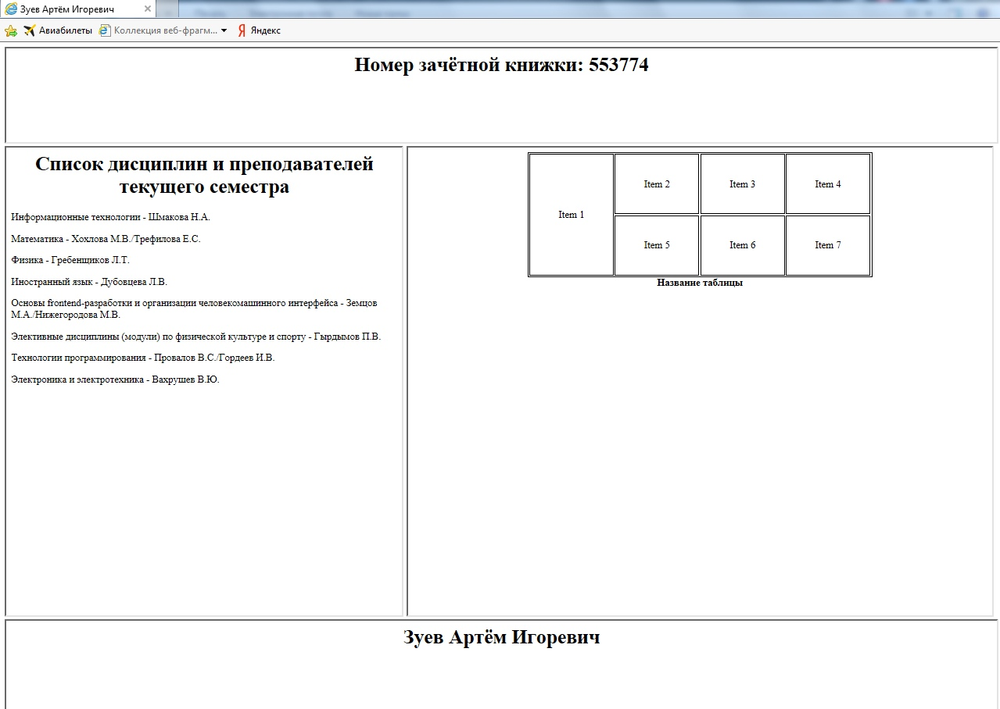
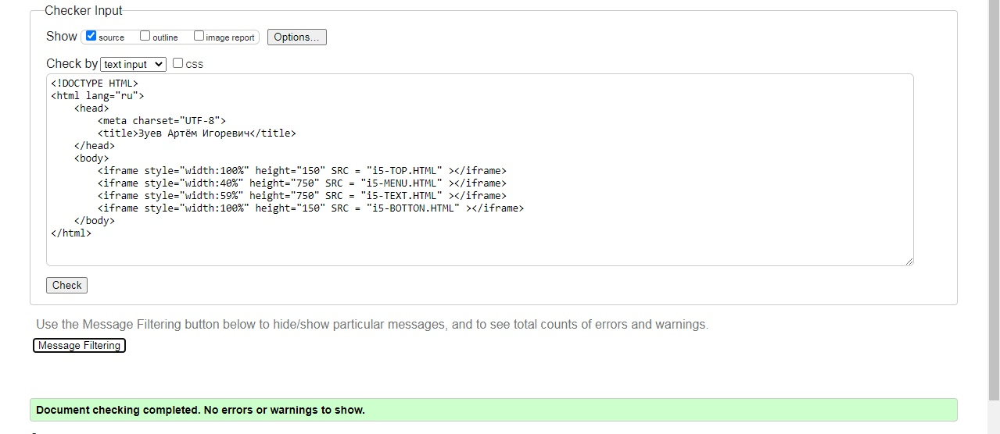
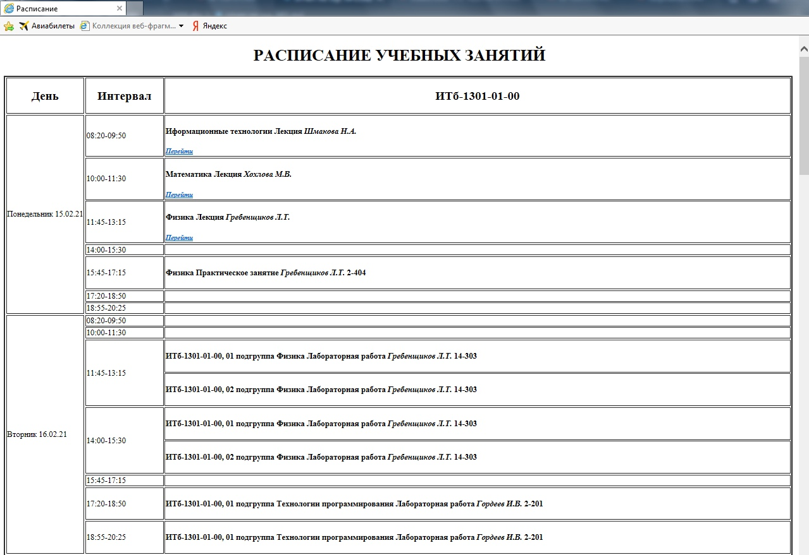
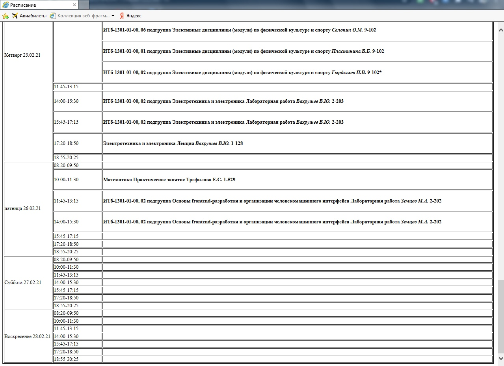

МИНИСТЕРСТВО НАУКИ И ВЫСШЕГО ОБРАЗОВАНИЯ РОССИЙСКОЙ ФЕДЕРАЦИИ 
ФЕДЕРАЛЬНОЕ ГОСУДАРСТВЕННОЕ БЮДЖЕТНОЕ ОБРАЗОВАТЕЛЬНОЕ  
УЧРЕЖДЕНИЕ ВЫСШЕГО ОБРАЗОВАНИЯ 
«ВЯТСКИЙ ГОСУДАРСТВЕННЫЙ УНИВЕРСИТЕТ» 
Институт математики и информационных систем 
Факультет автоматики и вычислительной техники 
Кафедра систем автоматизации управления 

 
 
 
 
 
 
 
 
 

<b>Изучение методов формирования html</b> 
Отчет по лабораторной работе № 1 
по дисциплине 
Основы frontend-разработки и организации человеко-машинного интерфейса 

 
 
 
 
 
 

Выполнил студент гр. ИТб-1301-01-00	        _________________ /Зуев А.И./ 
Руководитель ст. преподаватель		        _________________ /Земцов М.А./ 

 
 

Киров 2021

 
 
 

Цель лабораторной работы: изучение методов формирования html5 документов на стороне клиента. 
 
Задачи лабораторной работы: 
<ol><li>Организовать рабочее пространство и процессы разработки html5 документов.</li>
<li>Изучить структуру html5 документа</li>
<li>Исследовать функциональные возможности инструментов разработчика на стороне браузера</li>
<li>Изучить типовые элементы структуры html5 документа</li>
<li>Составить отчет по выполненным задачам</li>
li>Защитить лабораторную работу</li></ol>

<h4>Задание 1</h4>

Создайте HTML-страницу index4.html, разделенную на фреймы в соответствии с номером варианта. В качестве заголовка страницы используйте ваше имя, отчество и фамилию. Фреймы должны содержать:
№1 – номер зачетной книжки; 
№2 – таблицу (варианты приведены на рис.3); 
№3 – ваше имя, отчество и фамилию; 
№4 – список дисциплин и преподавателей текущего семестра

Web-страница, созданная в соответствии с первым заданием, представлена на рисунке 1.

Рисунок 1  – Web-страница по заданию 1

Подтверждение успешной валидации результата представлено на рисунке 2

Рисунок 2  – Валидация результата 

<h4>Задание 2</h4>

Создайте файл index.html, используя html5 разметку. Файл должен реализовывать предыдущее задание с использованием языка html5.

Web-страница, созданная в соответствии со вторым заданием, представлена на рисунке 3.

Рисунок 3  – Web-страница по заданию 2

Подтверждение успешной валидации результата представлено на рисунке 4

Рисунок 4  – Валидация результата 

<h4>Задание 3</h4>

Используя методы разметки текста реализуйте текущее расписание занятий на 2 недели. При реализации необходимо чтобы ссылки на онлайн лекции были меньше и выделены жирным курсивом, фамилия преподавателя была курсивом, а название дисциплины было h4. Использованием стилей недопустимо.

Расписание, реализованное на HTML-странице, представлено на рисунках 5-6.

Рисунок 5  – Расписание на начало недели

Рисунок 6  – Расписание на конец недели

<h4>Вывод:</h4>

Язык HTML, эволюционируя, приобретает новые синтаксические особенности, которые позволяют улучшить восприятие кода сторонним лицом, влияя на компактность и читаемость.
