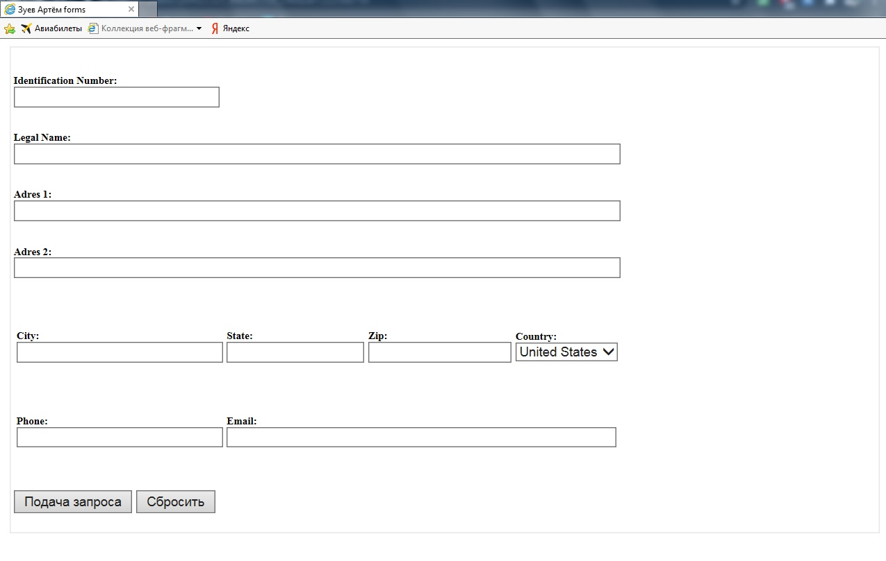
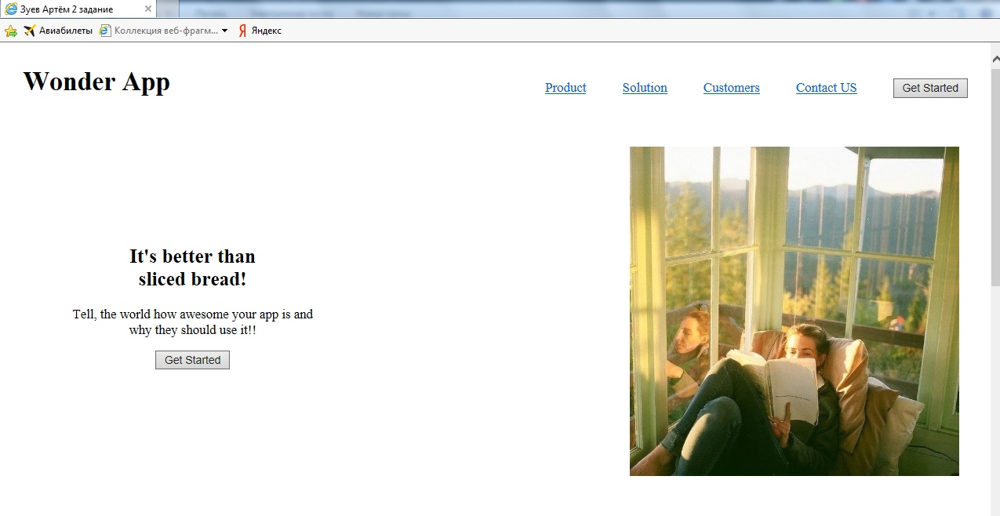
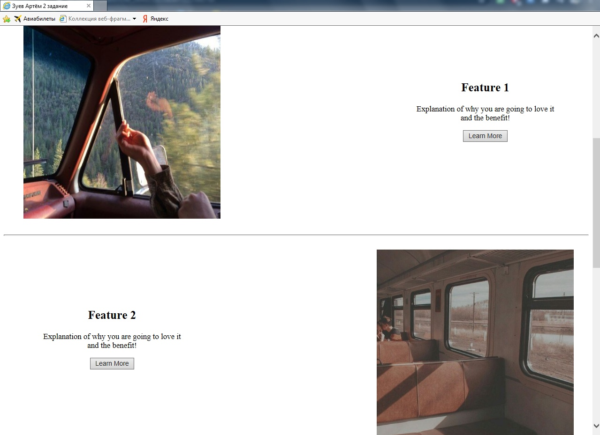
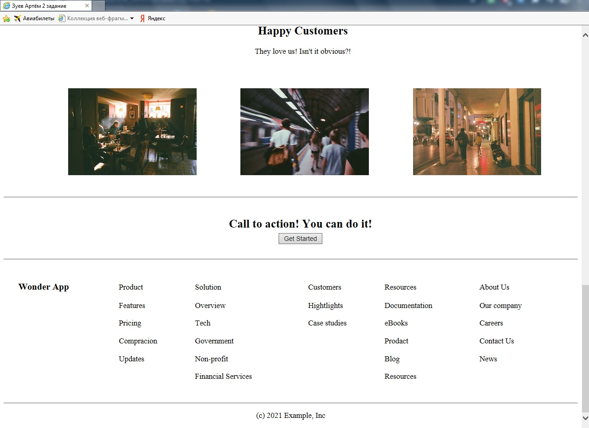
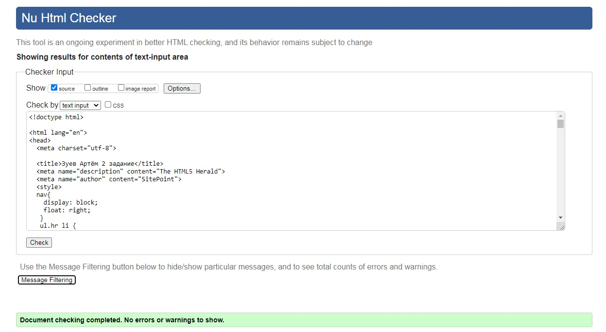

МИНИСТЕРСТВО НАУКИ И ВЫСШЕГО ОБРАЗОВАНИЯ РОССИЙСКОЙ ФЕДЕРАЦИИ 
ФЕДЕРАЛЬНОЕ ГОСУДАРСТВЕННОЕ БЮДЖЕТНОЕ ОБРАЗОВАТЕЛЬНОЕ  
УЧРЕЖДЕНИЕ ВЫСШЕГО ОБРАЗОВАНИЯ 
«ВЯТСКИЙ ГОСУДАРСТВЕННЫЙ УНИВЕРСИТЕТ» 
Институт математики и информационных систем 
Факультет автоматики и вычислительной техники 
Кафедра систем автоматизации управления 

 
 
 
 
 
 
 
 
 

<b>Изучение блочных элементов и компонентов разметки форм в HTML5</b> 
Отчет по лабораторной работе № 2 
по дисциплине 
Основы frontend-разработки и организации человеко-машинного интерфейса 

 
 
 
 
 
 

Выполнил студент гр. ИТб-1301-01-00	        _________________ /Зуев А.И./ 
Руководитель ст. преподаватель		        _________________ /Земцов М.А./ 

 
 

Киров 2021

 
 
 

<h1>Задание 1</h1>

Разработайте макет формы регистрации пользователя. Код должен быть валидирован под HTML5

Разработанная мною форма представлена на рисунке 1. Проверка кода на валидность продемонстрирована на рисунке 2.

Рисунок 1 – Вид разработанной мною формы 

 

Рисунок 2 – Успешная проверка кода на валидность первого задания

 

<h1>Задание 2</h1>

Создайте каркас сайта по варианту
 

Разработанный мною сайт представлен на рисунках 3-5. Проверка кода на валидность продемонстрирована на рисунке 6. 

Рисунок 3 – Шапка сайта 

 

Рисунок 4 – Центральная часть сайта 

 

Рисунок 5 – Подвал сайта 

 

Рисунок 6 – Успешная проверка кода на валидность второго задания

 

Вывод: блочные элементы выступают в качестве основного строительного материала при верстке веб-страниц.

